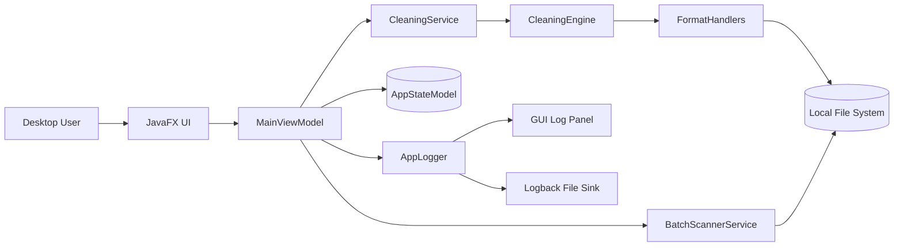
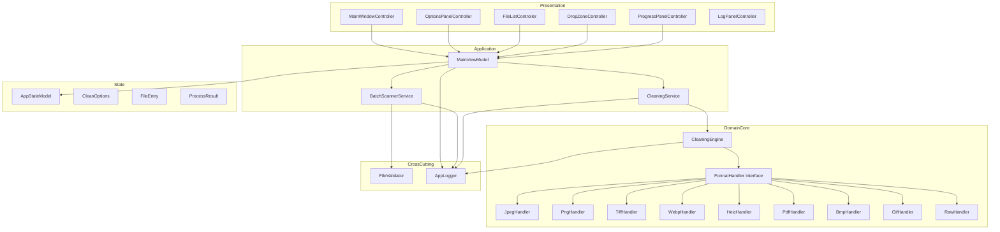
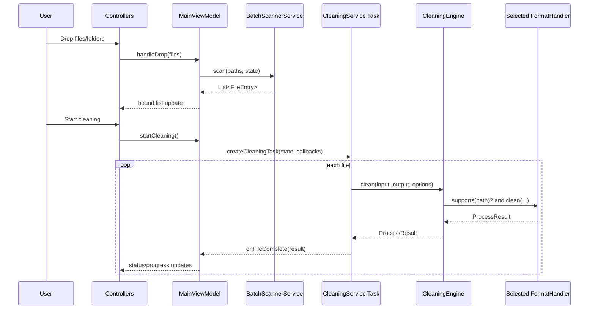

# Project Architecture Blueprint

Generated: 2026-04-08
Project: ExifCleaner

## 1. Architecture Detection and Analysis

### Technology stack detected
- Language: Java 17
- UI framework: JavaFX 21 (FXML + CSS)
- Build system: Maven
- Logging: SLF4J + Logback
- Metadata and format libraries:
  - metadata-extractor (read-only summary only)
  - Apache PDFBox
  - Apache Commons Imaging
  - TwelveMonkeys ImageIO TIFF plugin
- Test stack: JUnit 5 (Jupiter) with parameterized tests

### Architectural pattern detected
- Primary: Layered MVVM-style desktop architecture
- Supporting patterns:
  - Strategy pattern for format-specific cleaning handlers
  - Manual dependency injection (constructor wiring in application bootstrap)
  - Task-based background execution via JavaFX Task

### Evidence in codebase
- Layer boundaries reflected by package structure:
  - view, viewmodel, model, service, core, utilities
- Handler abstraction via FormatHandler interface and concrete implementations
- Central composition root in App startup wiring

## 2. Architectural Overview

ExifCleaner is a desktop processing pipeline that isolates GUI concerns from metadata-cleaning logic:
- UI controllers react to user actions and bind controls to observable properties.
- ViewModel orchestrates scanning and cleaning workflows without importing UI controls.
- Services perform scanning and background task orchestration.
- Core engine resolves file handlers and delegates format-specific logic.
- Utilities encapsulate cross-cutting support such as logging and format validation.

### Guiding principles
- Non-destructive processing: source files are never overwritten.
- Content-based trust: format detection by magic bytes, not extension alone.
- Deterministic processing: single worker thread for stable ordering.
- Explicit composition: no hidden container behavior.

### Boundary enforcement
- Core and service packages have no JavaFX scene/control dependency.
- JavaFX control-level code is contained in view controllers.
- State mutation routes through AppStateModel, reducing duplicated state.

### Hybrid traits
- MVVM is adapted for JavaFX with controller components acting as view glue.
- Some service callbacks are simple consumers instead of event bus messages.

## 3. Architecture Visualization

### 3.1 System context (C4-style)



### 3.2 Internal component relationships



### 3.3 Processing flow (data and control)



## 4. Core Architectural Components

### 4.1 Application composition root

#### Purpose and responsibility
- Bootstraps JavaFX scene and wires all major dependencies.
- Ensures log sink registration occurs before service construction.

#### Internal structure
- App startup loads FXML, creates state, handlers, engine, services, viewmodel.
- createHandlers defines handler priority order.

#### Interaction patterns
- Manual constructor injection from top-level root.
- Single shared MainViewModel passed to all sub-controllers.

#### Evolution patterns
- New handlers are added in createHandlers.
- Additional services can be composed here without changing controllers.

### 4.2 Presentation layer (view package)

#### Purpose and responsibility
- Host JavaFX controls, input events, and bindings.

#### Internal structure
- Main window delegates behavior to sub-controllers.
- Options panel maps user toggles to ViewModel properties.

#### Interaction patterns
- One-way commands (start, cancel, clear).
- Two-way property binding for option controls.

#### Evolution patterns
- New UI panels integrate by injecting same ViewModel contract.

### 4.3 ViewModel layer

#### Purpose and responsibility
- Coordinates workflows and maps domain status to UI-observable properties.

#### Internal structure
- Owns worker executor and active task lifecycle.
- Updates file status and warning logs per result.

#### Interaction patterns
- Delegation to scanner and cleaning services.
- Callback-driven progress and completion handling.

#### Evolution patterns
- New workflows should be added as methods that orchestrate services, not direct I/O.

### 4.4 Service layer

#### Purpose and responsibility
- Scan preparation and execution orchestration.

#### Internal structure
- BatchScannerService: recursive walk + filtering + detection + dedup.
- CleaningService: Task factory + cancellation + per-file result conversion.

#### Interaction patterns
- Services are synchronous from caller perspective except task execution.
- Task callbacks allow ViewModel updates without tight coupling to UI controls.

#### Evolution patterns
- Additional pre-processing services can be inserted before task creation.

### 4.5 Core engine and format handlers

#### Purpose and responsibility
- Handler resolution and format-specific metadata cleaning.

#### Internal structure
- CleaningEngine holds immutable ordered handler list.
- Each handler implements supports, clean, getMetadataSummary.

#### Interaction patterns
- First-match handler routing by supports(Path).
- Read-only metadata summary separated from removal path.

#### Evolution patterns
- New file format support is additive via interface implementation.
- Existing handlers can be replaced without modifying engine contracts.

### 4.6 Model and state layer

#### Purpose and responsibility
- Centralized mutable state + immutable snapshots/results.

#### Internal structure
- AppStateModel stores observable properties and lists.
- CleanOptions is immutable record snapshot for task consistency.

#### Interaction patterns
- ViewModel mutates state through property accessors.
- CleaningService consumes CleanOptions snapshot.

#### Evolution patterns
- New options should be added to AppStateModel and CleanOptions together.

### 4.7 Utilities and cross-cutting support

#### Purpose and responsibility
- Logging, format detection, and domain exceptions.

#### Internal structure
- AppLogger supports buffered startup logging and dual sinks.
- FileValidator centralizes magic-byte detection logic.

#### Interaction patterns
- Utility calls from service/core layers.
- No reverse dependency back into view.

#### Evolution patterns
- Additional validators can be introduced beside FileValidator.

## 5. Architectural Layers and Dependencies

### Layer map
1. Presentation (view)
2. ViewModel (viewmodel)
3. Application services (service)
4. Core domain engine and strategies (core)
5. Shared state and data contracts (model)
6. Cross-cutting utilities (utilities)

### Dependency rules
- view -> viewmodel (allowed)
- viewmodel -> service/model/utilities (allowed)
- service -> core/model/utilities (allowed)
- core -> model/utilities (allowed)
- model -> core enums only where needed (minimal)
- utilities -> no dependency on view/viewmodel (required)

### Abstraction mechanisms
- FormatHandler interface isolates format strategies.
- CleanOptions/ProcessResult contracts decouple task orchestration from handler internals.

### Circular dependency observations
- No direct cyclic package dependencies observed in main runtime path.
- Most coupling is directional from UI toward core.

### DI approach
- Manual DI in startup code.
- No Spring/CDI container, reflection wiring, or AOP proxies.

## 6. Data Architecture

### Core data model
- AppStateModel: mutable observable aggregate for session state.
- FileEntry: immutable queued file descriptor with status transitions by replacement.
- CleanOptions: immutable options snapshot.
- ProcessResult: immutable per-file processing output.

### Relationship map
- AppStateModel aggregates many FileEntry and ProcessResult records.
- CleaningService consumes AppStateModel snapshot and emits ProcessResult list.
- ViewModel updates AppStateModel and exposes derived display counters.

### Data transformation patterns
- File inputs -> Path list -> scanned FileEntry list.
- AppStateModel -> CleanOptions snapshot at task creation.
- Handler output -> ProcessResult -> state and UI binding updates.

### Caching strategy
- No explicit persistent cache.
- Temporary in-memory buffering in AppLogger for startup log events.

### Validation strategy
- Extension prefilter in scanner.
- Authoritative magic-byte detection in FileValidator.
- Unsupported or malformed files become skipped/failed outcomes with warnings.

## 7. Cross-Cutting Concerns Implementation

### Authentication and authorization
- Not applicable for this desktop, local-only application.
- No identity or role model is implemented.

### Error handling and resilience
- Services convert checked failures to ProcessResult FAILED entries where appropriate.
- Batch scanning continues on per-file access failures.
- Cleaning supports cooperative cancellation and marks remaining as SKIPPED.

### Logging and monitoring
- AppLogger dispatches to SLF4J backend and optional GUI sink.
- Early logs are buffered until GUI sink registration.
- Operational visibility is local (console/log file + in-app log panel).

### Validation
- Multi-stage validation pipeline:
  - extension check
  - magic-byte signature check
  - format filter toggles

### Configuration management
- Centralized constants and defaults in AppConfig.
- Logging backend configured by logback.xml.
- No environment-profile or external secret manager integration.

## 8. Service Communication Patterns

### Boundaries and protocols
- In-process communication only (method calls and callbacks).
- No network protocol between components.

### Sync vs async
- Scan path: synchronous call/return.
- Clean path: asynchronous JavaFX Task on background worker.
- UI updates: JavaFX property binding and task progress/message updates.

### Versioning and discovery
- No API versioning; this is an internal monolith.
- No service discovery mechanism.

### Resilience in communication
- Callback model prevents hard dependency on UI controls inside services.
- Exception conversion isolates failures to per-file results.

## 9. Technology-Specific Architectural Patterns (Java)

### Application container and bootstrap
- JavaFX Application class acts as composition root.
- FXMLLoader composes view tree and sub-controller graph.

### Dependency injection style
- Explicit constructor and setter injection; no framework container.

### AOP and transaction boundary
- No AOP or transaction framework present.
- Boundaries are explicit method boundaries and immutable data handoff.

### Persistence and ORM usage
- No relational persistence layer or ORM in current architecture.
- File system acts as primary data source/sink.

### Service implementation style
- Stateless or minimally stateful services.
- Task orchestration in service, state ownership in AppStateModel.

## 10. Implementation Patterns

### Interface design patterns
- Small interface for per-format behavior:
  - supports(Path)
  - clean(Path, Path, CleanOptions)
  - getMetadataSummary(Path)

### Service implementation patterns
- Create task with immutable input snapshot.
- Iterate file list, update progress/message, process file, emit callback.

### Repository patterns
- Not applicable (no repository layer in this codebase).

### Controller and UI interaction patterns
- Controllers bind controls to ViewModel properties.
- Controllers trigger ViewModel commands for actions.

### Domain model patterns
- Immutable records for process contracts.
- Observable properties concentrated in AppStateModel.

## 11. Testing Architecture

### Strategy
- Unit-style tests for handlers, services, and utilities.
- Real-file fixtures generated in temporary directories for format behavior.
- JavaFX toolkit initialized in tests that execute Task behavior.

### Test boundaries
- Core tests: handler behavior and engine routing.
- Service tests: scan and task workflow correctness.
- Utility tests: validator signatures and logger sink behavior.

### Test doubles
- Minimal mocking; tests mostly exercise real components with controlled inputs.

### Test data strategy
- Temporary files and generated images in @TempDir.
- Synthetic magic-byte payloads for detection edge cases.

### Tooling
- Maven Surefire + JUnit Platform.
- JUnit Jupiter and parameterized tests.

## 12. Deployment Architecture

### Packaging topology
- Maven jar packaging.
- JavaFX runtime launched via javafx-maven-plugin for local execution.
- Optional package generation through standard Maven lifecycle.

### Environment adaptations
- Desktop runtime assumptions.
- No environment-specific runtime profiles found.

### Runtime dependency resolution
- Dependencies resolved by Maven and local repository.
- No container image or orchestration manifests detected.

### Cloud integration
- None detected.

## 13. Extension and Evolution Patterns

### Feature addition patterns
- Add UI feature:
  - add state property in AppStateModel
  - expose/bind through MainViewModel
  - bind control in controller
- Add processing feature:
  - extend CleanOptions and handling logic in services/handlers

### Safe modification patterns
- Preserve handler interface contract.
- Keep task cancellation/progress semantics unchanged.
- Keep source file immutability invariant.

### Integration patterns
- External format integration via new FormatHandler implementation.
- Register new handler in App composition root.

### Backward compatibility guidance
- Default new options in AppConfig to preserve existing behavior.
- Keep ProcessResult fields stable for UI and tests.

## 14. Architectural Pattern Examples

### Layer separation example

```java
// service layer delegates to core; no UI control references
ProcessResult result = engine.clean(entry.path(), outputPath, options);
```

### Dependency injection example

```java
// composition root wires dependencies explicitly
BatchScannerService scannerService  = new BatchScannerService();
CleaningService cleaningService = new CleaningService(engine);
mainViewModel = new MainViewModel(state, scannerService, cleaningService);
```

### Extension-point example

```java
// format support extension by interface implementation
public interface FormatHandler {
    boolean supports(Path path);
    ProcessResult clean(Path inputPath, Path outputPath, CleanOptions options)
        throws MetadataRemovalException;
    Map<String, String> getMetadataSummary(Path path);
}
```

### State snapshot example

```java
// options are snapshotted once per task creation
CleanOptions options = state.toCleanOptions();
```

## 15. Architectural Decision Records

### ADR-001: Layered MVVM-style desktop architecture
- Context: JavaFX desktop app needs responsive UI and maintainable logic separation.
- Decision: Use view/viewmodel/model + service/core split.
- Consequences:
  - Positive: testable non-UI logic, clearer ownership.
  - Negative: additional mapping/orchestration code.

### ADR-002: Manual dependency injection in startup
- Context: Small codebase with explicit composition requirements.
- Decision: Wire all dependencies in App startup.
- Consequences:
  - Positive: transparent lifecycle and ordering.
  - Negative: composition changes require App updates.

### ADR-003: Strategy handlers for format processing
- Context: Multiple file formats with divergent metadata structures.
- Decision: FormatHandler interface + concrete per-format implementations.
- Consequences:
  - Positive: extensible format support, isolated risk.
  - Negative: handler ordering and capability overlap must be managed.

### ADR-004: Magic-byte based file detection
- Context: Extension spoofing and malformed inputs are common.
- Decision: Validate by signature bytes through FileValidator.
- Consequences:
  - Positive: stronger correctness and safety.
  - Negative: additional read overhead and specialized checks.

### ADR-005: Single-worker cleaning execution
- Context: Deterministic ordering and simpler thread safety needed.
- Decision: Use single-thread executor for cleaning workflow.
- Consequences:
  - Positive: reduced concurrency complexity.
  - Negative: lower peak throughput for large batches.

## 16. Architecture Governance

### How consistency is maintained
- Package-level separation mirrors architecture boundaries.
- Handler contract enforces common processing shape.
- AppConfig centralizes constants/defaults.

### Automated checks observed
- Maven test suite covers core/services/utilities behavior.
- No dedicated architectural lint rule set currently detected.

### Documentation practices
- README and ARCHITECTURE guides summarize runtime and modules.
- Javadoc coverage has been improved for public/protected APIs.

### Recommended governance enhancements
- Add package dependency checks (forbidden imports) in build.
- Add architecture decision logs as discrete ADR files.
- Add CI workflow to run tests and style checks on pull requests.

## 17. Blueprint for New Development

### Development workflow by feature type
1. UI-only feature
   - Add new control in FXML and controller binding.
   - Add state property exposure in ViewModel and AppStateModel.
   - Add focused controller and viewmodel tests where possible.
2. New metadata rule in existing format
   - Extend relevant handler logic.
   - Add/adjust ProcessResult warnings if behavior changes.
   - Add handler-level tests for the new case.
3. New file format support
   - Implement new FormatHandler.
   - Register handler in App.createHandlers.
   - Add validator detection updates if needed.
   - Add dedicated handler and engine routing tests.

### Implementation templates

#### Template: new handler skeleton
```java
public final class AvifHandler implements FormatHandler {
    @Override
    public boolean supports(Path path) {
        // signature check path
        return false;
    }

    @Override
    public ProcessResult clean(Path inputPath, Path outputPath, CleanOptions options)
            throws MetadataRemovalException {
        // read source, strip supported metadata blocks, write output
        return null;
    }

    @Override
    public Map<String, String> getMetadataSummary(Path path) {
        // read-only summary map for UI preview
        return Map.of();
    }
}
```

#### Template: ViewModel command
```java
public void runFeature() {
    if (state.isProcessing()) return;
    // orchestrate services, update task properties, emit logs
}
```

### Common pitfalls to avoid
- Writing directly to source file path.
- Bypassing FileValidator with extension-only checks.
- Introducing JavaFX control dependencies into service/core packages.
- Reading mutable AppStateModel properties repeatedly mid-task instead of snapshotting.
- Forgetting to register new handler in composition root.

### Update recommendation
- Revisit this blueprint when one of the following changes occurs:
  - new architectural layer introduced
  - multi-threaded processing model adopted
  - plugin/module loading strategy added
  - persistence or remote APIs introduced
