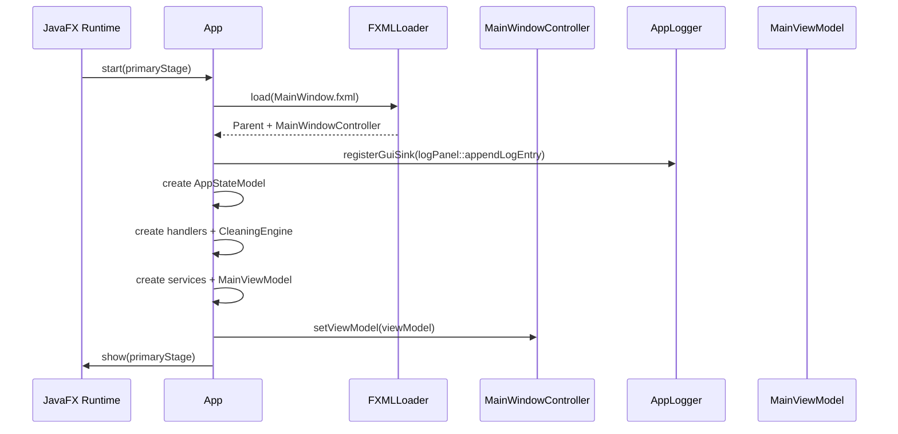
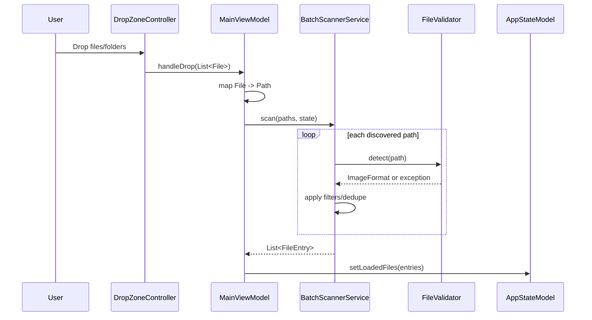
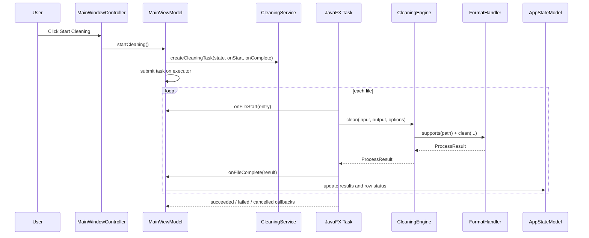

# Project Workflow Blueprint

Generated: 2026-04-09
Project: ExifCleaner

## Configuration Used

- PROJECT_TYPE: Auto-detect -> Java (Java 17, JavaFX 21, Maven)
- ENTRY_POINT: Auto-detect -> Frontend/Custom (JavaFX controllers)
- PERSISTENCE_TYPE: Auto-detect -> File System
- ARCHITECTURE_PATTERN: Auto-detect -> Layered + MVVM-style orchestration
- WORKFLOW_COUNT: 4
- DETAIL_LEVEL: Implementation-Ready
- INCLUDE_SEQUENCE_DIAGRAM: true
- INCLUDE_TEST_PATTERNS: true

## Initial Detection Phase

### Technology and framework detection
- Primary language: Java
- Desktop framework: JavaFX (FXML controllers + property bindings)
- Build and test tooling: Maven + JUnit 5
- Core libraries:
  - SLF4J + Logback for logging
  - metadata-extractor for read-only metadata summary
  - PDFBox and Commons Imaging for format-specific handling

### Entry point detection
This system has no HTTP API or GraphQL resolver entry points.
The dominant workflow entry points are UI-controller events:
- drag-and-drop handlers
- button click handlers
- startup wiring during JavaFX Application start

### Persistence mechanism detection
No database or repository pattern is present.
Persistence and I/O happen directly through file-system interactions:
- recursive scanning via Files.walkFileTree
- header and payload read/write via Files.* and stream APIs
- output generation in same folder or custom folder

---

## Workflow 1: Application Startup and Dependency Wiring

### 1. Workflow Overview

- Name: App bootstrap and runtime wiring
- Purpose: Build the runtime graph in a deterministic order before user interaction.
- Trigger: JavaFX runtime invokes App.start(Stage).
- Involved files/classes:
  - src/main/java/com/exifcleaner/App.java
  - src/main/java/com/exifcleaner/view/MainWindowController.java
  - src/main/java/com/exifcleaner/viewmodel/MainViewModel.java
  - src/main/java/com/exifcleaner/service/BatchScannerService.java
  - src/main/java/com/exifcleaner/service/CleaningService.java
  - src/main/java/com/exifcleaner/core/CleaningEngine.java
  - src/main/java/com/exifcleaner/model/AppStateModel.java
  - src/main/java/com/exifcleaner/utilities/AppLogger.java

### 2. Entry Point Implementation

#### Frontend/custom entry point

Primary entry method:

```java
@Override
public void start(Stage primaryStage) throws IOException
```

Key bootstrap sequence:
1. Load MainWindow.fxml and get MainWindowController.
2. Register GUI log sink before constructing services.
3. Construct AppStateModel.
4. Construct handlers and CleaningEngine.
5. Construct BatchScannerService and CleaningService.
6. Construct MainViewModel and inject into controller tree.
7. Apply scene/theme and show stage.

### 3. Service Layer Implementation

Relevant constructors and wiring:

```java
BatchScannerService scannerService  = new BatchScannerService();
CleaningService cleaningService     = new CleaningService(engine);
mainViewModel = new MainViewModel(state, scannerService, cleaningService);
mainController.setViewModel(mainViewModel);
```

Dependency injection pattern:
- Manual constructor injection in composition root (App).
- No DI container or annotation-driven runtime wiring.

### 4. Data Mapping Patterns

- No external DTOs in startup flow.
- Mapping is object graph composition:
  - Controller -> ViewModel
  - ViewModel -> Services + State
  - Service -> Engine

### 5. Data Access Implementation

- FXML and CSS are loaded from classpath resources.
- No SQL or NoSQL interaction.
- File-system persistence not used in startup phase except log file sink configuration.

### 6. Response Construction

- UI readiness is the startup response:
  - stage shown
  - initial log message emitted
- Startup errors are thrown from start and surfaced by JavaFX runtime.

### 7. Error Handling Patterns

- Startup method declares throws IOException.
- Logging capture begins before service instantiation to avoid early log loss.
- AppLogger buffers messages before sink registration and flushes afterward.

### 8. Asynchronous Processing Patterns

- None in startup path itself.
- Startup configures components used later for async cleaning tasks.

### 9. Testing Approach

Relevant tests for startup-adjacent cross-cutting behavior:
- src/test/java/com/exifcleaner/utilities/AppLoggerTest.java
  - verifies early buffering and sink flush behavior.

### 10. Sequence Diagram



---

## Workflow 2: File Intake, Validation, and Queue Construction

### 1. Workflow Overview

- Name: Input ingestion and scan pipeline
- Purpose: Convert user-selected files/folders into validated queue entries.
- Trigger:
  - DropZoneController.onDragDropped(DragEvent)
  - DropZoneController.openFileBrowser()
- Involved files/classes:
  - src/main/java/com/exifcleaner/view/DropZoneController.java
  - src/main/java/com/exifcleaner/viewmodel/MainViewModel.java
  - src/main/java/com/exifcleaner/service/BatchScannerService.java
  - src/main/java/com/exifcleaner/utilities/FileValidator.java
  - src/main/java/com/exifcleaner/model/FileEntry.java
  - src/main/java/com/exifcleaner/model/AppStateModel.java

### 2. Entry Point Implementation

#### Frontend entry handlers

```java
private void onDragDropped(DragEvent event)
private void openFileBrowser()
```

Both entry handlers call:

```java
viewModel.handleDrop(files)
```

Main orchestration method:

```java
public void handleDrop(List<File> files)
```

### 3. Service Layer Implementation

Core service call:

```java
public List<FileEntry> scan(List<Path> inputPaths, AppStateModel state)
```

Scan internals:
- walkPath -> recursive traversal for directories
- addIfValid -> extension gate, signature detection, filter checks, dedupe

### 4. Data Mapping Patterns

Input to queue mapping:

```java
List<Path> paths = files.stream().map(File::toPath).collect(Collectors.toList());
List<FileEntry> entries = scannerService.scan(paths, state);
state.setLoadedFiles(entries);
```

Format-to-display mapping occurs in BatchScannerService.toDisplayFormat.

### 5. Data Access Implementation

File-system access patterns:
- Files.walkFileTree for recursive traversal
- Files.isRegularFile / Files.isDirectory checks
- FileValidator.detect(path) for signature validation

No repositories, ORM mappings, or transaction patterns are present.

### 6. Response Construction

Queue response format:
- List<FileEntry> with absolute normalized Path, display format, PENDING status.
- UI updates through bound observable list in AppStateModel.

### 7. Error Handling Patterns

- visitFileFailed logs warning and continues traversal.
- Invalid signatures throw UnsupportedFormatException/IOException in detect and are converted to skipped warnings.
- Scanner is fail-soft: one bad file does not abort batch discovery.

### 8. Asynchronous Processing Patterns

- Scan path is synchronous.
- Asynchronous orchestration begins only in cleaning workflow.

### 9. Testing Approach

Primary tests:
- src/test/java/com/exifcleaner/service/BatchScannerServiceTest.java
  - recursive folder scanning
  - duplicate elimination
  - invalid signature rejection
  - max batch cap behavior

### 10. Sequence Diagram



---

## Workflow 3: Batch Cleaning Execution and Progress Tracking

### 1. Workflow Overview

- Name: Start-cleaning pipeline
- Purpose: Process queued files with selected options and produce per-file results.
- Trigger: MainWindowController Start button -> MainViewModel.startCleaning().
- Involved files/classes:
  - src/main/java/com/exifcleaner/view/MainWindowController.java
  - src/main/java/com/exifcleaner/viewmodel/MainViewModel.java
  - src/main/java/com/exifcleaner/service/CleaningService.java
  - src/main/java/com/exifcleaner/core/CleaningEngine.java
  - src/main/java/com/exifcleaner/core/formats/FormatHandler.java
  - src/main/java/com/exifcleaner/model/CleanOptions.java
  - src/main/java/com/exifcleaner/model/ProcessResult.java
  - src/main/java/com/exifcleaner/view/ProgressPanelController.java

### 2. Entry Point Implementation

Frontend command binding:

```java
btnStartCleaning.setOnAction(e -> viewModel.startCleaning());
```

Primary orchestrator:

```java
public void startCleaning()
```

### 3. Service Layer Implementation

Task factory signature:

```java
public Task<List<ProcessResult>> createCleaningTask(
    AppStateModel state,
    Consumer<FileEntry> onFileStart,
    Consumer<ProcessResult> onFileComplete)
```

Engine processing signature:

```java
public ProcessResult clean(Path inputPath, Path outputPath, CleanOptions options)
```

Handler contract:

```java
ProcessResult clean(Path inputPath, Path outputPath, CleanOptions options)
```

### 4. Data Mapping Patterns

Option snapshot mapping:

```java
CleanOptions options = state.toCleanOptions();
List<FileEntry> files = new ArrayList<>(state.getLoadedFilesUnmodifiable());
```

Status mapping:
- onFileStart: FileEntry -> PROCESSING via withStatus.
- onFileComplete: ProcessResult.status -> row update in loaded list.

### 5. Data Access Implementation

File-system interaction points:
- CleaningEngine.resolveOutputPath for deterministic output path.
- Handler-specific read/write logic in format implementations.

No SQL/NoSQL query or transaction behavior exists.

### 6. Response Construction

Per-file response object:

```java
new ProcessResult(
    inputPath,
    outputPath,
    FileStatus.DONE/FAILED/SKIPPED,
    bytesSaved,
    processingTimeMs,
    warnings,
    errorMessage)
```

UI response construction:
- taskProgressProperty and taskMessageProperty bindings
- filesCounter updates from result counts

### 7. Error Handling Patterns

- processFile catches UnsupportedFormatException and MetadataRemovalException and returns FAILED result.
- Task lifecycle handlers:
  - setOnSucceeded
  - setOnFailed
  - setOnCancelled
- Logging at each stage via AppLogger.

### 8. Asynchronous Processing Patterns

- Background execution through JavaFX Task submitted to single-thread executor.
- Task updates:
  - updateProgress(i, total)
  - updateMessage(currentFile)
- Cancellation checks before processing each file.

### 9. Testing Approach

Primary tests:
- src/test/java/com/exifcleaner/service/CleaningServiceTest.java
  - empty list behavior
  - successful single-file run
  - callback invocation
  - unsupported file -> FAILED result
- src/test/java/com/exifcleaner/core/CleaningEngineTest.java
  - format routing
  - output path resolution
  - non-destructive guarantees

### 10. Sequence Diagram



---

## Workflow 4: Cancellation, Reset, and Shutdown Lifecycle

### 1. Workflow Overview

- Name: Operational interruption and cleanup
- Purpose: Safely stop active processing and reset app state.
- Trigger:
  - Cancel button -> MainViewModel.cancelCleaning()
  - Clear button -> MainViewModel.clearAll()
  - App stop -> App.stop()
- Involved files/classes:
  - src/main/java/com/exifcleaner/view/MainWindowController.java
  - src/main/java/com/exifcleaner/viewmodel/MainViewModel.java
  - src/main/java/com/exifcleaner/service/CleaningService.java
  - src/main/java/com/exifcleaner/model/AppStateModel.java
  - src/main/java/com/exifcleaner/App.java

### 2. Entry Point Implementation

Frontend command bindings:

```java
btnCancel.setOnAction(e -> viewModel.cancelCleaning());
btnClearAll.setOnAction(e -> viewModel.clearAll());
```

Application lifecycle entry:

```java
@Override
public void stop()
```

### 3. Service Layer Implementation

Cancellation behavior in task loop:
- if isCancelled(): log cancellation and mark remaining files as SKIPPED.

Reset behavior:
- AppStateModel.resetToDefaults() clears queue/results and restores defaults.

### 4. Data Mapping Patterns

- Remaining queued files are mapped to SKIPPED ProcessResult entries:

```java
new ProcessResult(path, null, FileStatus.SKIPPED, 0L, 0L, List.of(), "Cancelled")
```

### 5. Data Access Implementation

- No direct file I/O for cancellation/reset path, except any in-flight handler that completes before cancellation boundary.

### 6. Response Construction

- Cancellation response is reflected through:
  - task cancellation callback
  - state isProcessing false
  - result list including skipped remainder entries

### 7. Error Handling Patterns

- Cancel and clear are guarded by processing state checks.
- stop() always attempts graceful cancellation and executor shutdown.

### 8. Asynchronous Processing Patterns

- Cancellation is cooperative, not force-kill at arbitrary point.
- Boundary is before next file starts.

### 9. Testing Approach

- CleaningService test suite verifies task outcomes and callback behavior.
- MainViewModel state transition behavior can be extended with targeted unit tests for cancel/clear lifecycle.

### 10. Sequence Diagram

```mermaid
sequenceDiagram
    participant User
    participant UI as MainWindowController
    participant VM as MainViewModel
    participant Task as Cleaning Task
    participant State as AppStateModel
    participant App as App

    User->>UI: Click Cancel
    UI->>VM: cancelCleaning()
    VM->>Task: cancel(true)
    Task->>Task: isCancelled check per file
    Task->>Task: markRemainingSkipped(...)
    Task-->>VM: onCancelled
    VM->>State: setProcessing(false)

    User->>UI: Click Clear
    UI->>VM: clearAll()
    VM->>State: resetToDefaults()

    App->>VM: stop() during app shutdown
    VM->>VM: cancelCleaning(); shutdown()
```

---

## Naming Conventions

### Class naming
- Controllers: *Controller
- Services: *Service
- ViewModel: MainViewModel
- Core handlers: *Handler
- Models: noun records/classes (FileEntry, ProcessResult, CleanOptions)

### Method naming
- Event handlers: onDragDropped, openFileBrowser, removeSelected
- Workflow commands: startCleaning, cancelCleaning, clearAll
- Service actions: scan, createCleaningTask, processFile
- Core actions: clean, resolveOutputPath, getMetadataSummary

### Variable patterns
- path/file semantics are explicit (inputPath, outputPath, customOutputFolder)
- callbacks use clear semantic names (onFileStart, onFileComplete)

### File organization
- src/main/java organized by layer concern (view/viewmodel/service/core/model/utilities)
- src/test/java mirrors main package structure

---

## Technology-Specific Implementation Patterns (Java)

### JavaFX composition and DI style
- FXML controllers are instantiated by FXMLLoader.
- MainViewModel is injected after load via MainWindowController.setViewModel.
- Manual DI performed in App.start, not with Spring/CDI.

### Service + task pattern
- Use JavaFX Task for background work.
- Report progress and current message via task APIs.
- Keep task input immutable via snapshot records.

### Domain contract style
- Immutable record contracts for file and result data.
- withStatus helper for immutable status transition.

### Logging style
- AppLogger facade with dual sink design:
  - SLF4J backend
  - optional GUI sink
- Startup buffering avoids dropped pre-UI logs.

---

## Implementation Templates

### Template 1: Add new frontend-triggered workflow

```java
// Controller
btnNewAction.setOnAction(e -> viewModel.runNewAction());

// ViewModel
public void runNewAction() {
    if (state.isProcessing()) return;
    // orchestrate service call
    // update state and log
}
```

### Template 2: Add a new service method

```java
public List<ResultType> execute(List<InputType> input, AppStateModel state) {
    List<ResultType> results = new ArrayList<>();
    for (InputType item : input) {
        // validate
        // process
        // collect result
    }
    return results;
}
```

### Template 3: Add a filesystem adapter-style method

```java
private OutputType readOrSkip(Path path) {
    try {
        // Files.* operations
        return success;
    } catch (IOException ex) {
        AppLogger.warn("Skipped: " + path + " — " + ex.getMessage());
        return fallback;
    }
}
```

### Template 4: Add a new model contract

```java
public record NewResult(
    Path path,
    FileStatus status,
    String message
) {}
```

### Template 5: Add robust error handling in task processing

```java
try {
    return engine.clean(inputPath, outputPath, options);
} catch (UnsupportedFormatException | MetadataRemovalException ex) {
    AppLogger.error("Error processing: " + inputPath.getFileName(), ex);
    return new ProcessResult(inputPath, null, FileStatus.FAILED, 0L, elapsedMs, List.of(), ex.getMessage());
}
```

---

## Testing Patterns

### Unit test strategy by layer
- Core: deterministic behavior tests using generated temporary images.
- Service: orchestration tests with AppStateModel and task execution.
- Utilities: signature matrix and logging sink behavior.

### Fixture and data generation
- @TempDir for isolated filesystem tests.
- Generated small images via ImageIO for format tests.
- Byte-array signatures for validator boundary tests.

### Parameterized tests in place
- FileValidatorParameterizedTest demonstrates:
  - @MethodSource
  - @ValueSource
  - @CsvSource
  - @EnumSource

### API/controller test note
- No HTTP API/controller layer exists in this project.
- Equivalent entry behavior is validated through service/core and controller-adjacent logic.

---

## Implementation Guidelines

### 1) Step-by-step process for adding similar features

1. Define desired user action in a controller.
2. Add orchestration method in MainViewModel.
3. Add/extend service implementation for work execution.
4. Use immutable model contracts for task inputs/results.
5. Add tests in corresponding package under src/test/java.
6. Update docs in README and ARCHITECTURE documents.

### 2) Common pitfalls to avoid

- Mixing JavaFX control code into service/core layers.
- Mutating AppStateModel concurrently from multiple worker threads.
- Relying on extension-only format checks.
- Forgetting to snapshot options before background execution.
- Ignoring cancellation boundaries in long loops.

### 3) Extension mechanisms

- Format extension point: implement FormatHandler and register in App.createHandlers.
- Workflow extension point: add ViewModel command + service method + tests.
- Configuration extension: add property in AppStateModel and include in CleanOptions snapshot.

---

## Conclusion

The most important consistency rules in this codebase are:
- Keep frontend event handling in controllers, orchestration in ViewModel, execution in services, and format logic in core handlers.
- Preserve non-destructive file semantics and signature-based validation.
- Use immutable snapshots and result contracts for background workflow stability.
- Maintain fail-soft behavior (skip or fail per file) and keep batches progressing.
- Add tests alongside workflow changes to preserve deterministic behavior and architecture boundaries.
